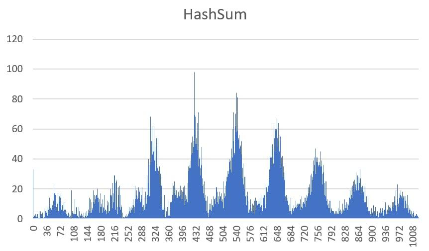

# Hash-Table with optimizations

 

## General info
---------------
Implementation of a hash table on lists.  The hash table has 6 possible hash functions:    
   1. A hash function that returns 1 for any input data 
   2. A hash function that returns the ascii code of the first character of a word
   3. A hash function that returns the length of a word as a hash
   4. A hash function that returns as a hash the sum of ascii codes of all characters
   5. Hash function based on ROL:

    u_int32_t hashRol(char *elem)
    {
        if (!elem)  ERR(ERRS::WRONG_PTR);

        int i    = 1,
            hash = elem[0];

        while (elem[i] != '\0')
        {
            hash = makeRol(hash) ^ elem[i];

            i++;
        }

    return hash;
    }

   6. CRC32 hash-func

## Research of hashing algorithms
---------------------------------

In our experiment, the hash table will have a length of 1024 lists. Therefore, any hash will be taken modulo 1024.  Our task is to check the uniformity of the distribution of hash values for different words. The text of William Shakespeare's collection with a length of 243806 words, of which 16265 are unique, was taken as the text for processing.

> ### Hash1 researching

> ### HashAscii researching

> ### HashLength researching

> ### HashSum researching

> ### HashRol researching

> ### CRC32 researching

## Conclusion on hashing algorithms
The effectiveness of hash functions will be evaluated by the number of collisions and their volume. The best hash function turned out to be CRC32. Next come HashRol and HashSum, HashRol does not have as many large collisions as HashSum, however, the volume of those that are much larger than the volume of HashSum collisions, in which they are distributed over the entire range. All other hash functions are equally bad, since I have many large collisions, the hash function values do not even occupy the entire range of values.

## Optimization

The first series of measurements will be carried out with the standard optimization flag (-O0). 

Testing will be carried out with the CRC32 hash function, as it ensures uniformity of the lengths of the lists, so the search for an element in the table is fast. When using other hash functions, searching through the list takes considerable time (more than half of the total execution time).

> ### An unoptimized program

    
    91929 processor clock cycles

It can be seen from here that the longest function is hash counting, so we will write this function in assembler using registers. (We'll write it in a separate file and link it)

 

> ### CRC32 asm version
%20-%20O0.png)

    79576 processor clock cycles

It can be seen that the hash calculation still takes considerable time, but within the framework of this version of the program we cannot optimize it in any other way.

"strcmp" takes the second place in terms of execution time, so we will write our own on C. (We use the fact that all words are no longer than 32 characters)

Here we show how we use this fact:

    static int strCmP2(u_int64_t *first, u_int64_t *second)
    {
        if ((*first) != (*second)) return 1; first++; second++;
        if ((*first) != (*second)) return 1; first++; second++;
        if ((*first) != (*second)) return 1; first++; second++;
        if ((*first) != (*second)) return 1; first++; second++;

        return 0;
    }

 

> ### CRC32 asm version & strcmp (fast C version)
%20crc32%20(asm)%20.png)

    73491 processor clock cycles

Let's try to speed up the program even more so that the influence of word search slows down the program even less. Let's rewrite this function in assembler.

 

> ### CRC32 & strcmp (asm version)
%20crc32%20(comp)%20.png)

    71609 processor clock cycles

As you can see, there is an increase, but it is not very large. Therefore, this type of optimization can be applied if the performance of the program is in the first place. In another case, the time gained may not be comparable with the labor costs.

 

_________________________________________________
 The contribution of the strcmp function is now in find Elem Str, so the hash calculation function and string comparison are still leading in terms of resource consumption. Let's write an AVX version of the program that will quickly calculate the hash and compare strings. But before that, you need to take all the measurements again, but with the optimization flag -O2. This is necessary for a correct comparison of performance with the program on the AVX instruction.
_________________________________________________

 

> ### An unoptimized program -O2

    74295 processor clock cycles

 

> ### CRC32 asm version
%20strcmp.png)

    73102 processor clock cycles

 

> ### CRC32 asm version & strcmp (fast C version)

%20strcmp(fast%20C).png)

    62859 processor clock cycles

 

> ### CRC32 & strcmp (asm version)
.png)

    62260 processor clock cycles

 

_________________________________________________
With the -O2 flag, writing your own strcmp function in assembler gives a performance gain of less than a percent, so this type of optimization turns out to be useless.
_________________________________________________ 

 

> ### AVX version

    44012 processor clock cycles

## Conclusion on optimization

We tried to optimize the program by writing the most resource-intensive parts of the program in assembler. However, this did not give much more gain than compiling with the -O2 flag. At the same time, if you use AVX processor instructions, then the separation from -O2 will be significant.

## Installation

    git clone https://github.com/jirol9xa/Hash-Table

For running noAVX version

    make noAVX && ./pics/table

For running AVX version

    make AVX && ./pics/avx